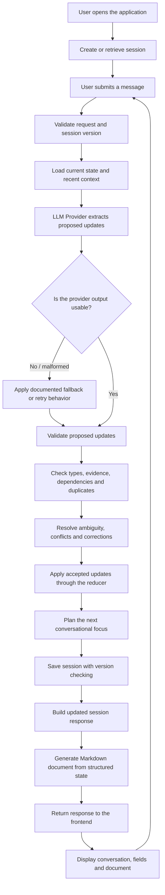
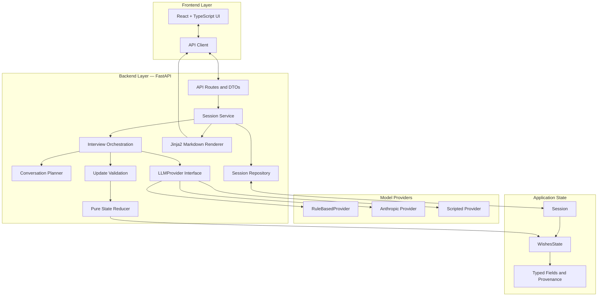
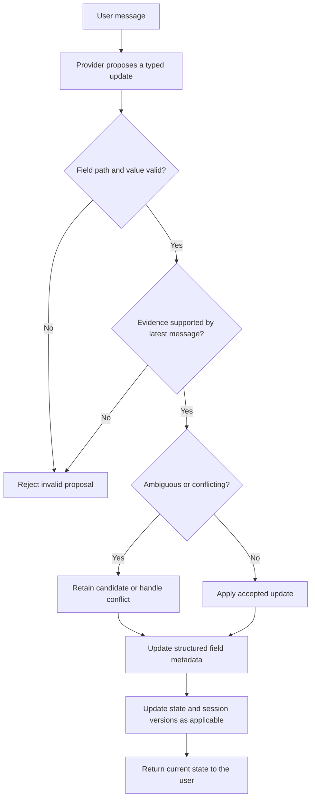

# AI-Powered Personal Wishes Interview Assistant

An interactive, multi-turn AI application that converts a user's conversational responses into a structured Personal Wishes Document draft through evidence-based extraction, typed validation, explicit ambiguity handling, and controlled state updates.

**Live Demo:** [Open Application](https://sharwil-winup-assignment.onrender.com)  
**Source Code:** [GitHub Repository](https://github.com/sharwil22/sharwil-winup-assignment-final)

---

## 1. Project Overview

The application guides a user through a conversational interview, identifies relevant information from their responses, validates proposed updates, and maintains a structured representation of their wishes.

Rather than allowing an LLM to directly modify application state, the system uses a controlled processing pipeline. The model proposes updates; application-side validation and reduction logic determine which changes are accepted.

### Core Principle

> **The model proposes; the application decides.**

This separates probabilistic language-model output from deterministic application logic, making state transitions easier to validate, explain, and test.

### Key Capabilities

- **Multi-turn conversation:** Collects information incrementally instead of requiring a single long form.
- **Structured extraction:** Converts natural-language responses into typed field updates.
- **Evidence validation:** Checks that proposed evidence is supported by the latest user message.
- **Ambiguity handling:** Represents unclear information as a candidate instead of automatically treating it as confirmed.
- **Conflict and correction handling:** Preserves relevant previous values and supports corrections.
- **Dependency-aware processing:** Handles relationships between fields, including whether the user has children and their children's names.
- **Optimistic concurrency:** Uses expected versions to prevent updates based on stale session state.
- **Document generation:** Produces a Markdown Personal Wishes Document from the current structured state.
- **Provider abstraction:** Separates LLM integration from the interview and state-management logic.

---

## 2. Application Workflow — Start Here

The following diagram shows the complete high-level lifecycle, from the user's message to the updated application state and generated document.



**How to read this flowchart**

1. The user submits a message through the frontend.
2. The backend validates the request and loads the relevant session context.
3. The configured provider proposes structured updates.
4. Application-side validation checks whether the proposals are acceptable.
5. The reducer applies the accepted updates to the structured state.
6. The session is saved using version-aware concurrency control.
7. The backend prepares the updated session and Markdown document.
8. The frontend displays the resulting conversation and current information.

Malformed or unusable provider output is handled through the application's documented retry and fallback behavior. This does not mean every invalid proposal is accepted.

---

## 3. System Architecture

The application separates the user interface, HTTP API, conversational orchestration, model integration, validation, state management, and document rendering.



### Component Responsibilities

| Component | Responsibility |
|---|---|
| React + TypeScript | Presents the conversation and application state to the user. |
| FastAPI routes | Exposes HTTP endpoints and validates incoming requests. |
| Session service | Coordinates session operations and application workflows. |
| Interview orchestration | Coordinates extraction, validation, state updates, and the next conversational focus. |
| `LLMProvider` | Defines the interface for structured extraction providers. |
| Update validation | Checks proposed values, evidence, field types, dependencies, and duplicate paths. |
| State reducer | Applies accepted updates to the structured state. |
| Session repository | Stores and retrieves sessions; the default implementation is in-memory. |
| Conversation planner | Selects the next conversational focus based on the current state. |
| Jinja2 renderer | Generates the Markdown document from the structured wishes state. |

The diagram represents logical responsibilities; the detailed implementation and call sequence are documented in [`docs/ARCHITECTURE.md`](docs/ARCHITECTURE.md).

---

## 4. State Management and Validation

The application does not treat every extracted value as immediately confirmed. Each field carries structured information that supports controlled updates and traceability.

### Field Lifecycle



### Validation Responsibilities

- **Type checking:** Values must match their expected field types.
- **Evidence checking:** Evidence-backed proposals must be supported by the latest user message after the application's normalization rules.
- **Field-path checking:** Updates must target supported fields.
- **Duplicate detection:** Duplicate update paths within a proposal are rejected.
- **Dependency handling:** Related fields are processed in a defined order.
- **Ambiguity handling:** Unclear values can remain candidates instead of being promoted to confirmed values.
- **Conflict and correction handling:** The reducer applies the application's defined rules for corrections, conflicts, and previous values.
- **Concurrency control:** Writes use expected session versions to detect stale updates.

### Structured Field Information

A field can carry its value, status, candidate value, note, source turn, source, evidence, and previous value, as applicable.

The domain model distinguishes the version of the overall session from the version of the wishes state. A session version can advance on a successful save even when the wishes state itself has not changed.

For exact statuses, supported field paths, and reducer behavior, see [`docs/VALIDATION_AND_STATE.md`](docs/VALIDATION_AND_STATE.md).

---

## 5. Technology Stack

| Layer | Technologies |
|---|---|
| Backend | Python 3.12+, FastAPI, Uvicorn |
| Data validation | Pydantic v2, `pydantic-settings` |
| LLM integration | Anthropic SDK, structured-output provider abstraction |
| State and domain logic | Typed domain models, validation functions, pure reducer |
| Document generation | Jinja2, Markdown |
| Frontend | React 19, TypeScript, Vite |
| Markdown rendering | `react-markdown` |
| Backend quality tools | pytest, FastAPI TestClient, Ruff, mypy |
| Frontend quality tools | Vitest, Testing Library, jsdom, oxlint, TypeScript compiler |
| Development and deployment | uv, npm, Make, Docker, Render |

The project includes a rule-based provider for mock operation, alongside the provider abstraction used for model-backed operation.

---

## 6. API Reference

The backend exposes the following endpoints.

| Method | Endpoint | Purpose |
|---|---|---|
| `GET` | `/api/health` | Health check |
| `POST` | `/api/sessions` | Create a session |
| `GET` | `/api/sessions/{session_id}` | Retrieve a session |
| `POST` | `/api/sessions/{session_id}/messages` | Submit a conversational message |
| `PATCH` | `/api/sessions/{session_id}/fields` | Edit a supported field |
| `GET` | `/api/sessions/{session_id}/document` | Retrieve the generated Markdown document |

### Interactive API Documentation

When the backend is running locally:

- Swagger UI: `http://localhost:8000/docs`
- ReDoc: `http://localhost:8000/redoc`
- OpenAPI schema: `http://localhost:8000/openapi.json`

### API Design Considerations

- Request and response structures use typed schemas.
- Message requests enforce the configured content-length constraint.
- Version-aware writes use `expected_version`.
- API errors use structured responses for cases such as missing sessions, version conflicts, invalid requests, unavailable providers, and internal errors.
- The default in-memory repository does not provide durable persistence.

See [`docs/API_REFERENCE.md`](docs/API_REFERENCE.md) for request formats, response structures, field paths, and error details.

---

## 7. Running the Application Locally

### Prerequisites

- Python 3.12 or a compatible project-supported Python version
- Node.js and npm
- uv
- Git

### Installation

Clone the repository:

```bash
git clone https://github.com/sharwil22/sharwil-winup-assignment-final.git
cd sharwil-winup-assignment-final
```

Install project dependencies using the repository's Make target:

```bash
make install
```

Start the development environment:

```bash
make dev
```

Use the frontend and backend addresses reported by the development command. The documented local defaults are:

- Frontend: `http://localhost:5173`
- Backend: `http://localhost:8000`

### LLM Configuration

The application supports mock operation through the rule-based provider. For Anthropic-backed operation, configure the provider and API key using the project's supported environment settings.

```dotenv
LLM_PROVIDER=anthropic
ANTHROPIC_API_KEY=your_api_key_here
```

Use the repository's environment configuration for any additional settings. Do not commit API keys or other secrets.

---

## 8. Testing and Quality Checks

The repository includes backend and frontend testing and code-quality tooling.

| Area | Tools |
|---|---|
| Backend tests | pytest, FastAPI TestClient |
| Backend linting | Ruff |
| Backend static typing | mypy |
| Frontend tests | Vitest, Testing Library, jsdom |
| Frontend linting | oxlint |
| Frontend type checking | TypeScript compiler |

For exact test scope, commands, and documented results, see [`docs/TESTING.md`](docs/TESTING.md).

**Evaluation note:** The presence of test tooling does not itself establish that every test has passed. Consult the testing documentation for the results and execution details it records.

---

## 9. Deployment

The repository includes Docker and Render deployment configuration.

**Live application:** [https://sharwil-winup-assignment.onrender.com](https://sharwil-winup-assignment.onrender.com)

Deployment considerations:

- The application requires the appropriate environment configuration for its selected provider.
- The default in-memory repository stores sessions in process memory and does not provide durable persistence.
- Deployment configuration alone does not establish production-grade persistence, authentication, or security controls.

The live demo is provided for evaluator access. Its availability and behavior should be verified directly when evaluating the application.

---

## 10. Limitations and Security Considerations

The current architecture has important boundaries:

- No authentication or authorization is provided by the documented API.
- The default session repository is in-memory; session data is not durably persisted by that repository.
- The application produces a Personal Wishes Document draft; it does not establish that the document is legally valid.
- If the Anthropic provider is used, relevant user-provided information may be sent to the external model provider.
- Production use would require an explicit review of privacy, access controls, data retention, transport and storage security, and operational safeguards.

These limitations should be considered when interpreting the application as a prototype rather than a production legal-document service.

---

## 11. Documentation Index

The following documents provide deeper implementation details.

| Document | What the evaluator will find |
|---|---|
| [`PROJECT_DOCUMENTATION.md`](docs/PROJECT_DOCUMENTATION.md) | Project overview, features, setup, configuration, and repository structure |
| [`ARCHITECTURE.md`](docs/ARCHITECTURE.md) | Component architecture, request lifecycle, and implementation responsibilities |
| [`VALIDATION_AND_STATE.md`](docs/VALIDATION_AND_STATE.md) | Domain model, field metadata, validation rules, reducer behavior, and state versions |
| [`API_REFERENCE.md`](docs/API_REFERENCE.md) | Endpoints, schemas, requests, responses, and error behavior |
| [`TESTING.md`](docs/TESTING.md) | Testing approach, quality tools, commands, and documented results |

---

## 12. Evaluator Walkthrough

For the clearest review, follow this sequence:

1. **Open the live application** and inspect the initial interface.
2. **Start a session** and submit a message containing information relevant to the interview.
3. **Continue the conversation** to observe multi-turn information collection.
4. **Inspect the structured fields** and how the application represents the collected information.
5. **Test ambiguity or correction handling** by providing an unclear answer or correcting a previously supplied value.
6. **Inspect the generated Markdown document** and compare it with the current structured state.
7. **Open Swagger UI** to inspect the API endpoints and request schemas.
8. **Read the architecture and validation documentation** to understand how proposed updates are checked and applied.
9. **Review the testing documentation** for the recorded test scope and results.

This walkthrough is intended to make the user-facing behavior, backend design, validation strategy, and evaluation evidence straightforward to inspect.

---

## Project Summary

This project demonstrates a controlled conversational application in which an LLM assists with information extraction while application code remains responsible for validation, state transitions, concurrency checks, and document generation.

The architecture separates model-generated proposals from accepted state changes, uses typed domain structures, and makes the resulting workflow inspectable through the API and accompanying technical documentation.
