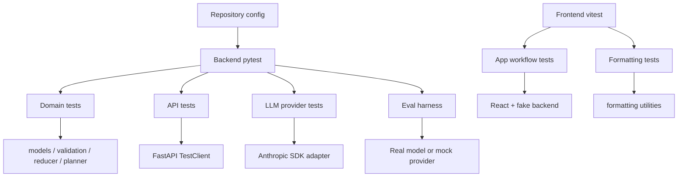

# Testing

This document describes the testing approach that is actually implemented in this repository. It is based on the source files under [backend/tests](../backend/tests), the frontend tests under [frontend/src](../frontend/src), the evaluation harness at [backend/scripts/eval.py](../backend/scripts/eval.py), and the tool configuration in [Makefile](../Makefile), [backend/pyproject.toml](../backend/pyproject.toml), and [frontend/package.json](../frontend/package.json).

## 1. Testing Overview

The project uses a layered testing strategy:

- Backend unit and integration tests validate the domain model, validation logic, reducer state transitions, planner ordering, interview orchestration, and API semantics.
- API tests exercise the FastAPI app end-to-end with `TestClient`, including version conflict handling and error mapping.
- Frontend tests exercise the React app behavior with Vitest and Testing Library, using a fake backend rather than a live server.
- LLM provider adapter tests cover the Anthropic SDK wrapper, including parsing, configuration checks, and error translation.
- Scripted evaluation runs a small set of scenario-driven conversations against the configured provider to check final state and final draft content.

This is not a single monolithic test suite. It is intentionally split by concern:

- Domain logic and state transitions are deterministic and testable without a real model.
- Model-provider behavior is tested separately, with real SDK error mapping and mock-provider contracts.
- Live-model evaluation uses the scripted harness in [backend/scripts/eval.py](../backend/scripts/eval.py), which is explicitly separate from the normal `pytest` suite.

What deterministic tests can verify:

- JSON schema conformance, state transitions, validation rules, reducer outcomes, route behavior, and UI workflows with mocked server responses.
- That the app behaves correctly under expected edge cases, such as malformed model output, contradictions, and stale versions.

What requires live LLM evaluation:

- Whether a real model produces the right field updates for natural-language interviews.
- Whether the model behaves robustly across varied phrasing, ambiguity, and context changes.
- Whether the output remains aligned with the application’s domain rules in production use.

The repository explicitly distinguishes these in [backend/scripts/eval.py](../backend/scripts/eval.py): it is for live model evaluation, not for ordinary CI validation.

## 2. Test Architecture

The actual tools and configuration are:

- Python backend tests use `pytest` from [backend/pyproject.toml](../backend/pyproject.toml).
- FastAPI routes are exercised with `fastapi.testclient.TestClient` in [backend/tests/test_api.py](../backend/tests/test_api.py).
- Frontend tests use `vitest`, `@testing-library/react`, `@testing-library/user-event`, and `jsdom` as configured in [frontend/package.json](../frontend/package.json).
- Lint and type-checking are configured via the Makefile and package scripts:
  - Backend: `ruff`, `mypy`
  - Frontend: `oxlint`, `tsc -b`

The project-level orchestration is defined in [Makefile](../Makefile):

- `make test` runs backend and frontend tests.
- `make lint` runs backend lint/type-checking and frontend lint/type-checking.
- `make eval` runs the scripted evaluation harness.

### Test doubles and fixtures

The repository uses test helpers and fake backends rather than a full browser stack:

- [backend/tests/helpers.py](../backend/tests/helpers.py) provides `upd(...)` and `state_with(...)`, which create `ProposedUpdate` objects and apply explicit updates directly to a state.
- [frontend/src/test/fakeBackend.ts](../frontend/src/test/fakeBackend.ts) provides a fake `fetch` implementation with queued route responses, call tracking, and error wrappers.
- [backend/tests/snapshots](../backend/tests/snapshots) stores golden Markdown snapshots for document rendering.
- The Anthropic adapter tests use a fake SDK client object in [backend/tests/test_anthropic_provider.py](../backend/tests/test_anthropic_provider.py) so the adapter can be tested without network calls.

### Testing layers



## 3. Backend Test Coverage

The backend test suite covers the domain and service layer across several files.

### 3.1 Domain models and field contracts

Covered by:

- [backend/tests/test_models.py](../backend/tests/test_models.py)

What it verifies:

- `WishesState.empty()` starts with nine fields at `missing`.
- `as_plain()` exposes only confirmed values and omits candidates.
- `with_field()` returns a new state without mutating the original.
- Gift values serialize correctly.
- JSON round-tripping of the state model works.

### 3.2 Semantic validation and evidence grounding

Covered by:

- [backend/tests/test_validation.py](../backend/tests/test_validation.py)

What it verifies:

- Valid multi-field messages are accepted and normalized.
- Evidence is required for chat updates and must appear in the user message.
- Case, whitespace, and punctuation differences are treated correctly during evidence matching.
- UI edits bypass evidence validation.
- Wrong types and empty values are rejected.
- Optional fields accept empty values as “none”.
- `children_names` is rejected when `has_children` is false unless a same-turn update flips it to true.
- Duplicate updates for the same path in one turn are rejected.
- Unknown field paths fail schema validation.

### 3.3 Reducer behavior

Covered by:

- [backend/tests/test_reducer.py](../backend/tests/test_reducer.py)

Actual behaviors covered:

- First answers capture values.
- Unclear answers remain as candidates and keep the confirmed value on the field if one exists.
- Contradictory answers produce a conflict and hold the new answer as a candidate.
- Corrections overwrite earlier values.
- Equivalent repeated values are no-ops.
- `has_children = false` sets `children_names` to `not_applicable`.
- Switching from false to true reopens the child-name field.
- `children_names` can imply `has_children = true`.
- Optional empty values are captured as empty lists or empty strings.
- `WishesState.version` increments only when the reducer changes state.
- The reducer never mutates its input state.

### 3.4 Planner ordering and completion

Covered by:

- [backend/tests/test_planner.py](../backend/tests/test_planner.py)

Actual behaviors covered:

- The first field is `full_name`.
- Captured fields are skipped in interview order.
- Clarification fields take priority over missing ones.
- Conflict questions name both answers precisely.
- Vague `home_address` answers request a full address.
- Yes/no ambiguity asks for a yes/no answer.
- Question phrasing uses the executor’s name when asking about the relationship.
- Progress counts `captured` and `not_applicable` fields.
- Completion is reached when no `needs_clarification` or `missing` fields remain.

### 3.5 Interview orchestration and malformed provider responses

Covered by:

- [backend/tests/test_interview.py](../backend/tests/test_interview.py)

Actual behaviors covered:

- Valid single- and multi-field messages capture state, reply messages, and warnings.
- Executor relationships are filled correctly.
- Vague addresses are held for clarification.
- Corrections overwrite earlier values.
- Contradictions are flagged and question wording is replaced precisely.
- Invented facts are rejected and not repeated in the assistant reply.
- Replies that ask about a captured field are replaced by the planner question.
- Malformed outputs are retried with a repair hint.
- Repeated malformed output leaves the state unchanged.
- Model refusals leave the state unchanged.
- Missing keys or unavailable providers cause configured application errors without mutating state.
- Recent history is included in the LLM context, and the model is told only about remaining open fields.

### 3.6 API endpoints, errors, and version conflicts

Covered by:

- [backend/tests/test_api.py](../backend/tests/test_api.py)

Actual behaviors covered:

- Creating a session returns the initial opening question and empty field state.
- The full conversation flow through FastAPI works end-to-end.
- `TurnResult` reports changes, reply text, warnings, and rejected updates.
- Rejected model output is surfaced in the API response.
- Stale `expected_version` values return HTTP 409 with a version conflict error.
- Concurrent save loss is rejected as a conflict.
- Unknown sessions yield 404s.
- Invalid message bodies yield 422s.
- Service/model failures are surfaced as 503s with correct error codes.
- Missing Anthropic configuration yields a helpful message.

### 3.7 Document generation

Covered by:

- [backend/tests/test_document.py](../backend/tests/test_document.py)
- Snapshots in [backend/tests/snapshots](../backend/tests/snapshots)

Actual behaviors covered:

- Rendering matches snapshot files for empty, partial, and complete states.
- Disclaimer text is applied at the top and bottom of the draft.
- Incomplete fields render placeholders.
- Unclear or conflicting answers are not rendered as confirmed values.
- Complete states render completion text and omit placeholders.
- “None” answers render as explicit statements.
- Relationship phrasing does not double-prefix “my”.
- Markdown injection is escaped deterministically.

### 3.8 LLM provider adapters and failure handling

Covered by:

- [backend/tests/test_anthropic_provider.py](../backend/tests/test_anthropic_provider.py)
- [backend/tests/test_mock_provider.py](../backend/tests/test_mock_provider.py)

Actual behaviors covered:

- The Anthropic adapter parses valid responses and converts them to domain updates.
- Structured-output schema metadata is included in the request.
- Missing API keys raise `LLMNotConfigured`.
- Refusals raise `LLMRefused`.
- Malformed or truncated outputs raise `LLMMalformedOutput`.
- SDK status errors map to application error types (`LLMNotConfigured` vs `LLMUnavailable`).
- The mock provider handles a demo conversation and reaches a complete state.
- Provider selection from settings works (`mock` vs `anthropic`).

### 3.9 Evaluation harness behavior

Covered by:

- [backend/tests/test_eval.py](../backend/tests/test_eval.py)

Actual behaviors covered:

- `Check` validation compares field status, exact or normalized equality, and invention checks.
- A scenario passes with a correct scripted model answer.
- Model errors are surfaced as failures instead of crashing the harness.
- The demo provider run exits cleanly and returns success for the mock provider path.

## 4. Frontend Test Coverage

The frontend tests are located under [frontend/src](../frontend/src) and focus on component workflows with a fake backend in [frontend/src/test/fakeBackend.ts](../frontend/src/test/fakeBackend.ts).

### 4.1 App workflow and session behavior

Covered by:

- [frontend/src/App.test.tsx](../frontend/src/App.test.tsx)

What it verifies:

- The app starts a session and shows the opening question, progress indicator, and draft preview.
- Chat submissions update the session, state panel, field list, and generated document.
- Retry behavior works when the backend returns a recoverable error.
- Stale version conflicts trigger reload guidance instead of silent overwrite.
- Direct field editing works and validation errors are surfaced from the backend.
- A field edit that reopens a question updates the next question correctly.
- The assistant reply is not repeated verbatim when it asks about a captured field.
- Missing model configuration shows a warning.
- Stored session IDs are reused on reload, and missing stored sessions fall back to a new session.

This is a deterministic front-end integration layer, not a browser E2E suite.

### 4.2 Formatting utilities

Covered by:

- [frontend/src/format.test.ts](../frontend/src/format.test.ts)

What it verifies:

- Formatting of booleans, empty values, lists, and gift values.
- Text round-tripping for specific gifts and children names.
- Parsing and validation of gift entries and comma-separated names.

### 4.3 Fake backend and local storage assumptions

The frontend tests rely on fake responses and local storage semantics rather than a full browser automation environment. This is important for interpretation: the tests cover the front-end state machine and UI logic, not a full browser-driven scenario across multiple pages or real network latency.

## 5. How to Run Tests

The exact commands come from [Makefile](../Makefile), [backend/pyproject.toml](../backend/pyproject.toml), and [frontend/package.json](../frontend/package.json).

### 5.1 Dependency installation

From the repository root:

```bash
make install
```

This runs:

```bash
cd backend && uv sync
cd backend && [ -f .env ] || cp .env.example .env
cd frontend && npm install
```

This is the repository’s installation path for the backend and frontend toolchains.

### 5.2 Backend tests

From the repository root:

```bash
make test-backend
```

This actually executes:

```bash
cd backend && uv run pytest -q
```

The backend configuration in [backend/pyproject.toml](../backend/pyproject.toml) sets pytest to discover tests under `tests`.

### 5.3 Frontend tests

From the repository root:

```bash
make test-frontend
```

This executes:

```bash
cd frontend && npm test -- --run
```

This runs the Vitest suite in one-shot mode.

### 5.4 Full test suite

From the repository root:

```bash
make test
```

This runs the backend and frontend tests in sequence:

```bash
cd backend && uv run pytest -q
cd frontend && npm test -- --run
```

### 5.5 Lint and type checks

From the repository root:

```bash
make lint
```

This runs:

```bash
cd backend && uv run ruff check . && uv run ruff format --check . && uv run mypy app tests scripts
cd frontend && npm run lint && npm run typecheck
```

### 5.6 Scripted evaluation harness

From the repository root:

```bash
make eval
```

This runs:

```bash
cd backend && uv run python -m scripts.eval
```

The harness supports provider override and scenario narrowing:

```bash
cd backend && uv run python -m scripts.eval --provider mock
cd backend && uv run python -m scripts.eval --only full_interview
```

The script itself explains the cost and provider requirements in its module docstring at [backend/scripts/eval.py](../backend/scripts/eval.py).

## 6. Evaluation Harness

The source-of-truth evaluation harness is [backend/scripts/eval.py](../backend/scripts/eval.py).

### 6.1 Scripted scenarios

The harness defines a fixed set of `Scenario` objects with names such as:

- `multi_field`
- `executor_relationship`
- `correction`
- `contradiction`
- `vague_address`
- `no_invention`
- `any_order`
- `full_interview`

Each scenario includes:

- A name and description.
- The sequence of user messages.
- Expected state checks (`Check` objects).
- Optional expected completion state.
- Expected document phrases.

This is a scripted evaluation of conversation flow and final state, not a general-purpose natural-language benchmark.

### 6.2 What the harness checks

The harness examines:

- State status and values at the end of a conversation.
- Whether disallowed invented facts appear in the final state.
- Whether the interview is complete at the expected point.
- Whether the rendered Markdown draft includes required phrases.
- Whether the app asks the same field again after it has already been captured.
- Whether reply replacement warnings occurred when a model reply was not trusted.

The harness also records the number of dropped replies replaced by the planner and the number of fallbacks triggered by malformed output.

### 6.3 Provider behavior and external API requirements

The harness uses `Settings()` and `build_provider(...)` from [backend/app/config.py](../backend/app/config.py) and [backend/app/llm/factory.py](../backend/app/llm/factory.py).

Important details:

- `--provider mock` uses the regex demo provider.
- `--provider anthropic` uses the Anthropic adapter.
- For the Anthropic provider, the script exits with a clear error if `ANTHROPIC_API_KEY` is not set.
- The script notes that the real-model run can cost money and is not part of the normal CI pipeline.

The script therefore explicitly treats live-model evaluation as a separate, external verification step rather than a unit-test guarantee.

### 6.4 Exit code and reliability

The harness returns:

- `0` when the configured provider run passes all scenarios in the selected configuration.
- `1` when one or more scenarios fail for a real provider run.
- `2` when Anthropic is selected without an API key.

This is a functional harness, but its pass/fail result is still only as good as the selected provider and the scripted scenarios. It is not a substitute for broader human evaluation or production monitoring.

### 6.5 Important limitation

The mock-provider results must not be presented as proof of general language understanding. The script itself warns that the mock provider is “expected to miss scenarios that need language understanding.” This is a deliberate regression guard, not a claim that the regex demo is a robust general model.

## 7. Verified Results

I did not execute the repository’s test suite or evaluation harness as part of this documentation task. This means the test outcomes in this document are based on repository source and configuration, not independent runtime verification.

The verification status is therefore:

- Source-based evidence: yes.
- Execution-based evidence: no.

This is consistent with the requirement to avoid inventing test results or pass rates.

The repository does contain strong, explicit test definitions for the behaviors above, but no fresh execution output from this session was used to claim pass or fail status.

## 8. Limitations and Further Testing

The repository’s current testing is useful, but it has clear gaps that are visible in the codebase:

- There is no browser end-to-end test suite. The frontend tests are component/workflow tests using a fake backend and jsdom, not real browser automation.
- The live-model evaluation is scripted and explicit, but not part of normal CI. It requires a real provider and may incur API costs.
- Mocked tests are deterministic and valuable, but they do not prove real model behavior in production settings.
- There is no production authentication or persistence layer being tested here; the tests are aimed at the behavior of the interview state machine and its API surfaces.
- There is no direct testing of multi-user concurrency outside the in-memory optimistic version check behavior at the API layer.

Potential future work that would be valuable:

- Live-provider acceptance testing against a real Anthropic account in a controlled environment.
- Browser-level end-to-end validation of the React app against a test backend.
- Broader negative testing around malformed provider output, schema drift, and multi-turn ambiguity handling.
- Long-session durability tests against a persistent backend once the storage layer exists.

## Conclusion

The repository uses a clear layered testing model: deterministic backend domain tests, API tests, frontend workflow tests, provider adapter tests, and a separate scripted live-evaluation harness. That structure is clearly reflected in the code and configuration, and it is appropriate for verifying the logic of a state-driven interview assistant without pretending that a mock or scripted run is equivalent to generic model intelligence.
