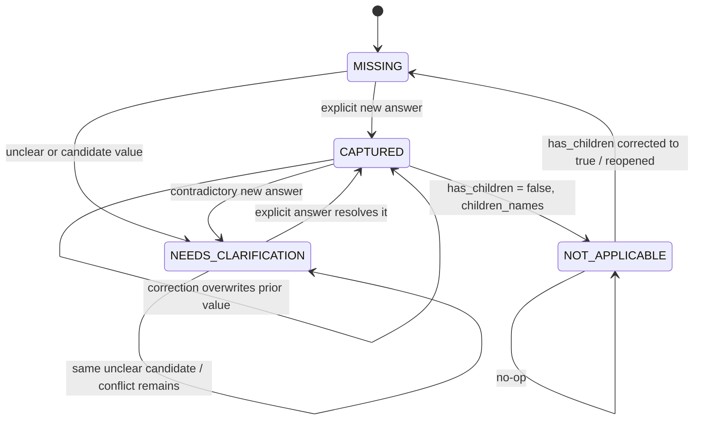

# Validation and State Model

This document describes the implementation that is actually in the repository, not a conceptual design. The authoritative code is in [../backend/app/domain/models.py](../backend/app/domain/models.py), [../backend/app/domain/updates.py](../backend/app/domain/updates.py), [../backend/app/domain/validation.py](../backend/app/domain/validation.py), [../backend/app/domain/reducer.py](../backend/app/domain/reducer.py), [../backend/app/domain/planner.py](../backend/app/domain/planner.py), [../backend/app/services/interview.py](../backend/app/services/interview.py), [../backend/app/services/sessions.py](../backend/app/services/sessions.py), [../backend/app/services/session_store.py](../backend/app/services/session_store.py), and [../backend/app/llm/contracts.py](../backend/app/llm/contracts.py).

## 1. Purpose and Design Principle

The central design statement in the code is: “The model proposes; the application decides.”

This is enforced in several places:

- The LLM contract in [../backend/app/llm/contracts.py](../backend/app/llm/contracts.py) defines the model-facing schema (`TurnExtraction` and `FieldUpdate`), but the server still validates and normalizes the values.
- Validation in [../backend/app/domain/validation.py](../backend/app/domain/validation.py) rejects malformed or semantically invalid updates before they touch state.
- Reduction in [../backend/app/domain/reducer.py](../backend/app/domain/reducer.py) decides whether a proposal becomes a confirmed value, a clarification candidate, or a conflict.
- Planning in [../backend/app/domain/planner.py](../backend/app/domain/planner.py) chooses the next question deterministically, based on state, not on the model’s freeform reply.
- The model’s reply is only trusted when it asks about the same field the planner selected and no updates were rejected or conflicts raised; otherwise the server overrides it in [../backend/app/services/interview.py](../backend/app/services/interview.py).

The distinction is:

- **Structured-output/schema validation:** whether the model response matches the required JSON shape, field names, types, and enum values. This is primarily Pydantic validation in [../backend/app/llm/contracts.py](../backend/app/llm/contracts.py).
- **Domain-semantic validation:** whether the value meaningful for the Personal Wishes document actually fits the field, matches the user’s words, respects dependencies, and does not duplicate another update in the same turn. This is done in [../backend/app/domain/validation.py](../backend/app/domain/validation.py).

The application therefore treats the model as a proposal engine, not as an authority. The final state transition logic remains in the application layer.

## 2. Field Model and Statuses

The actual field model is defined in [../backend/app/domain/models.py](../backend/app/domain/models.py).

### 2.1 `Field[T]`

```python
class Field[T](BaseModel):
    value: T | None = None
    status: FieldStatus = FieldStatus.MISSING
    candidate: T | None = None
    note: str | None = None
    source_turn: int | None = None
    source: Literal["chat", "edit"] | None = None
    evidence: str | None = None
    previous_value: T | None = None
```

Key semantics from the file header:

- `value` is only a confirmed value.
- `candidate` holds a proposed value waiting for clarification.
- `status` is explicit and never inferred from `None`.
- `source_turn`, `source`, and `evidence` describe provenance of a confirmed value.
- `previous_value` records the last confirmed value that was replaced by a correction.

### 2.2 Four implemented statuses

```python
class FieldStatus(StrEnum):
    MISSING = "missing"
    NEEDS_CLARIFICATION = "needs_clarification"
    CAPTURED = "captured"
    NOT_APPLICABLE = "not_applicable"
```

Meaning in the actual code:

- `MISSING`: the field is still open and has no confirmed value.
- `NEEDS_CLARIFICATION`: the field holds a candidate but the user’s answer is vague, conflicting, or otherwise not yet accepted.
- `CAPTURED`: the field has a confirmed value.
- `NOT_APPLICABLE`: a field has been explicitly set to “not relevant” for this intake, primarily `children_names` when `has_children` is `False`.

### 2.3 Provenance and metadata

These values are only populated when a field is actually captured:

- `source_turn`: the user turn that set the value.
- `source`: `"chat"` or `"edit"`.
- `evidence`: the user’s quoted words supporting the value, only for chat-originated answers.
- `previous_value`: if a correction replaced an earlier confirmed value, this stores the old value.

Notes are used in reducer logic to explain why a clarification is pending or why a `has_children` answer was implied.

### 2.4 Actual field paths

The nine field paths are defined in the literal `FieldPath` and `FIELD_PATHS` order:

| Path | Type | Completion rule in the actual code |
|---|---|---|
| `full_name` | `str` | Must be non-empty text. |
| `home_address` | `str` | Must be non-empty text. |
| `covers_worldwide_assets` | `bool` | Must be `true` or `false`. |
| `has_children` | `bool` | Must be `true` or `false`. |
| `children_names` | `list[str]` | Must be a non-empty list of names; rejected if `has_children` is confirmed `False` unless the same turn also says `True`. |
| `executor.name` | `str` | Must be non-empty text. |
| `executor.relationship` | `str` | Must be non-empty text. |
| `specific_gifts` | `list[Gift]` | Optional field; an empty list means “none”. Each gift has `item` and `recipient`. |
| `additional_wishes` | `str` | Optional field; empty string means “none”. |

The actual field order used by the planner is:

1. `full_name`
2. `home_address`
3. `covers_worldwide_assets`
4. `has_children`
5. `children_names`
6. `executor.name`
7. `executor.relationship`
8. `specific_gifts`
9. `additional_wishes`

This order comes directly from `FIELD_PATHS = get_args(FieldPath)` in [../backend/app/domain/models.py](../backend/app/domain/models.py).

## 3. Update Pipeline

The server-side flow is implemented in [../backend/app/services/interview.py](../backend/app/services/interview.py) and [../backend/app/services/sessions.py](../backend/app/services/sessions.py).

### 3.1 `TurnExtraction` and `FieldUpdate`

The model contract is in [../backend/app/llm/contracts.py](../backend/app/llm/contracts.py):

```python
class FieldUpdate(_Strict):
    path: FieldPath
    value: bool | str | list[str] | list[GiftOut]
    kind: Literal["new", "correction"]
    certainty: Literal["explicit", "unclear"]
    evidence: str

    def to_proposed(self) -> ProposedUpdate:
        ...
```

`TurnExtraction` is the top-level JSON object:

```python
class TurnExtraction(_Strict):
    updates: list[FieldUpdate]
    reply: str
    asks_about: FieldPath | None
```

The contract is intentionally separate from the domain model `ProposedUpdate` in [../backend/app/domain/updates.py](../backend/app/domain/updates.py). The model returns raw field updates; the application converts them into domain proposals with `to_proposed()`.

### 3.2 How proposals are formed

`handle_turn()` does the following:

1. Builds a `TurnContext` using the current state, remaining open fields, recent history, and user message.
2. Calls the provider’s `extract(ctx)` method.
3. Converts each `FieldUpdate` into a `ProposedUpdate` via `.to_proposed()`.
4. Calls `validate_updates()`.
5. Calls `reducer.apply(state, accepted_updates, turn)`.
6. Builds a `TurnOutcome` with the new `WishesState`, reply, next focus, changes, conflicts, rejected updates, and warnings.
7. Persists the result through `SessionService.send_message()` and the in-memory session repository.

### 3.3 Validation, reducer, planner, and session-save sequence

The actual sequence is:

1. `SessionService.send_message()` loads the current `Session` and checks `expected_version` against `session.version`.
2. `handle_turn()` calls the model and validation.
3. `validate_updates()` either accepts or rejects each model proposal.
4. `reducer.apply()` applies accepted updates to the `WishesState` and increments `WishesState.version` only if the state changed.
5. `next_focus()` and `next_question()` decide the next question.
6. `SessionService.send_message()` appends user and assistant messages, records `change_log`, and then calls `repository.save(updated, expected_version)`.
7. `InMemorySessionRepository.save()` atomically checks the version again and persists the next `Session.version`.

### 3.4 Mermaid flowchart of the actual pipeline

```mermaid
flowchart TD
    A[User message] --> B[SessionService.send_message]
    B --> C{expected_version matches session.version?}
    C -- no --> D[VersionConflict]
    C -- yes --> E[TurnContext]
    E --> F[provider.extract(ctx)]
    F --> G[TurnExtraction]
    G --> H[FieldUpdate.to_proposed()]
    H --> I[validate_updates()]
    I --> J{Rejected?}
    J -- yes --> K[reducer.apply(accepted updates)]
    J -- no --> K
    K --> L[next_focus / next_question]
    L --> M[TurnOutcome]
    M --> N[append user + assistant messages]
    N --> O[repository.save(updated, expected_version)]
    O --> P[Session.version = previous + 1]
    P --> Q[API response]
```

Direct UI edits follow a shorter path in [../backend/app/services/sessions.py](../backend/app/services/sessions.py): they create a `ProposedUpdate` with `source=UI_EDIT`, `kind=CORRECTION`, and then execute the same validation and reducer path without a model call.

## 4. Semantic Validation Rules

The semantic checks are in [../backend/app/domain/validation.py](../backend/app/domain/validation.py).

### 4.1 Type checks

These checks are enforced after the model JSON is structurally valid:

- Boolean paths (`covers_worldwide_assets`, `has_children`) must be actual Python `bool` values, not strings like `"yes"`.
- `children_names` must be a non-empty list of strings.
- `specific_gifts` must be a list of `Gift` objects or shape-compatible dictionaries that convert to `Gift`.
- All remaining fields must be text strings.
- Empty strings are rejected for required fields, but allowed for `specific_gifts` and `additional_wishes` as the “none” form.

### 4.2 Normalization

Text normalization is done by `clean_text()` in [../backend/app/domain/values.py](../backend/app/domain/values.py):

- Collapses repeated whitespace to a single space.
- Trims leading and trailing whitespace.
- Preserves the user’s original casing.

Evidence comparison is more permissive than exact string equality:

- `comparable_text()` lowercases text.
- Strips surrounding punctuation and whitespace.
- Ignores repeated whitespace.

This is how the system allows evidence like `"my BROTHER  james."` to match the user message `"My brother James"` without requiring exact formatting.

### 4.3 Required values and optional values

The actual implementation accepts empty values only for optional fields:

- `specific_gifts` accepts `[]` as “none”.
- `additional_wishes` accepts `""` as “none”.

Other text fields reject empty or whitespace-only values.

### 4.4 Evidence grounding

Chat-originated updates are rejected if they do not quote actual user words:

- If `evidence` is blank, rejection reason: `"no evidence quoted from the user's message"`.
- If the evidence text is not contained in the user message after normalization, rejection reason: `"evidence does not appear in the user's message"`.

This is intentionally strict: the model cannot invent facts.

`UpdateSource.UI_EDIT` bypasses this rule (`_check_evidence` returns `None` for UI direct edits), because the UI is treated as an explicit edit rather than a model claim.

### 4.5 Child-field dependencies

`children_names` has a dependency check:

- If `has_children` is already confirmed `False`, then names are rejected unless the same turn also sets `has_children` to `True`.
- The same-turn allow-list is implemented by `sets_children_true = any(u.path == "has_children" and u.value is True for u in updates)`.

This is how the code prevents the impossible combination of “no children” and “my son Tom” in the same state unless the user explicitly changes the answer.

### 4.6 Duplicate-path handling

The validator rejects additional updates for the same path inside the same turn:

- `duplicate update for 'executor.name' in one turn`

The first accepted update wins; the second is rejected regardless of value.

### 4.7 Direct UI edits vs chat updates

There is a deliberate difference in validation:

- Chat updates require evidence because they are presented as the model’s interpretation of the user’s message.
- UI edits are treated as direct correction events and do not require evidence.
- Both still go through the same reducer logic after validation.

## 5. Reducer Behavior

The reducer is defined in [../backend/app/domain/reducer.py](../backend/app/domain/reducer.py). The actual rules are stated in the file header and implemented in `_Reducer._next_field()`.

### 5.1 Core rules

The reducer performs these transitions:

- First answer: if a field is `MISSING` or `NEEDS_CLARIFICATION`, a new explicit update captures it.
- Unclear answer: `certainty == UNCLEAR` never becomes a confirmed value; it is stored in `candidate` and status is set to `NEEDS_CLARIFICATION`.
- Conflicting answer: if a captured field receives a different explicit value, the old confirmed value stays in `value`, the new proposal waits in `candidate`, and the field becomes `NEEDS_CLARIFICATION` with a note naming the conflict.
- Explicit correction: `UpdateKind.CORRECTION` overwrites the current field regardless of its status.
- Equivalent repeat: if a new update has the same value as the currently captured field, nothing changes and the reducer returns a no-op.
- Not-applicable: if `has_children` is `False`, `children_names` is set to `NOT_APPLICABLE`.

### 5.2 Preservation of previous confirmed values during clarification

When a new explicit answer conflicts with a captured answer, the reducer does not drop the prior value:

```python
self.conflicts.append(Conflict(update.path, current.value, update.value))
return current.model_copy(
    update={
        "status": FieldStatus.NEEDS_CLARIFICATION,
        "candidate": update.value,
        "note": f"Conflicts with earlier answer for {FIELD_LABELS[update.path]}: {format_value(current.value)}",
    }
)
```

The confirmed value remains in `value`; the contradictory answer is parked as `candidate` until the user resolves it.

This is also why the planner asks questions like: “Earlier you gave `"no"` for whether you have children, but now `"yes"`. Which is correct?”

### 5.3 Child-name logic

The special-case logic for `children_names` is in `_apply_children_names()` and `_sync_children_names()`.

Rules:

- If `has_children` is confirmed `True`, names are processed normally.
- If `has_children` is pending clarification with `candidate == True`, names wait in `NEEDS_CLARIFICATION` and ask the user to resolve the boolean first.
- If `has_children` is `MISSING` and names arrive, the system treats that as an implied `True`, captures the names, and sets `has_children.value = True` with note `"Implied by the children's names given"`.
- If `has_children` is confirmed `False`, names are not allowed and are set to `NOT_APPLICABLE` by `_sync_children_names()`.

### 5.4 `previous_value` and provenance

When an explicit correction replaces an earlier confirmed value, the code stores the old value:

```python
"previous_value": current.value if replaced else None,
"source_turn": turn,
"source": "edit" if edited else "chat",
"evidence": None if edited else (update.evidence or None),
```

This metadata is only available for a confirmed field; the API hides it when the field is not `CAPTURED` in [../backend/app/api/schemas.py](../backend/app/api/schemas.py).

### 5.5 Mermaid state diagram for supported transitions

The following diagram reflects the transitions that the code actually implements.



This is a conservative state machine: there is no logic for “restarting” a captured field to `MISSING` except via `has_children` reopening, and there is no generalized “clear field” command.

## 6. Planning and Completion

The planner is in [../backend/app/domain/planner.py](../backend/app/domain/planner.py).

### 6.1 Next field selection

`next_focus(state)` does this:

```python
unclear = [p for p in FIELD_PATHS if state.get(p).status == FieldStatus.NEEDS_CLARIFICATION]
missing = [p for p in FIELD_PATHS if state.get(p).status == FieldStatus.MISSING]
return (*unclear, *missing)[0] if any else None
```

This means the planner prioritizes:

1. Clarification-needed fields first.
2. Then missing fields.
3. In the fixed interview order defined by `FIELD_PATHS`.

This is the actual “what to ask next” logic. The model does not decide the sequence.

### 6.2 Question generation

`question_for(path, state)` is deterministic:

- If the field is `NEEDS_CLARIFICATION`, it asks a clarification question based on `candidate` and the field label.
- If `executor.relationship` is being asked and `executor.name` is already captured, it uses the executor’s name in the wording.
- Otherwise it uses the fixed template dictionary `_QUESTIONS`.

Examples from the code:

- `full_name` -> “What is your full name?”
- `home_address` -> “What is your home address?”
- `has_children` -> “Do you have any children?”
- `children_names` -> “What are your children's names?”
- `specific_gifts` -> “Are there any specific gifts you would like to leave…? You can say none.”

### 6.3 Completion and progress

`progress(state)` counts fields whose status is either `CAPTURED` or `NOT_APPLICABLE`:

```python
DONE_STATUSES = frozenset({FieldStatus.CAPTURED, FieldStatus.NOT_APPLICABLE})
completed = sum(1 for path in FIELD_PATHS if state.get(path).status in DONE_STATUSES)
return Progress(completed=completed, total=len(FIELD_PATHS))
```

`is_complete(state)` returns `next_focus(state) is None`.

The total is therefore 9, which matches the number of field paths.

## 7. Versioning and Concurrency

The repository-level versioning is in [../backend/app/services/session_store.py](../backend/app/services/session_store.py) and the API expects the caller to send `expected_version` for writes.

### 7.1 `WishesState.version` vs `Session.version`

These are different objects with different purposes:

- `WishesState.version` is a reducer-level version counter inside the domain state. It increments when a reducer change occurs and the reducer returns a new state.
- `Session.version` is the persisted session revision used for optimistic concurrency in the repository.

The reducer increments `WishesState.version` once per turn that changes anything:

```python
if self.changes:
    state = state.model_copy(update={"version": self.original.version + 1})
```

The repository saves a session as:

```python
saved = replace(session, version=current.version + 1)
```

So `Session.version` is the durable API-level concurrency guard, while `WishesState.version` is part of the field state snapshot.

### 7.2 Expected-version checks

`SessionService.send_message()` and `SessionService.edit_field()` both call `_check_version(session, expected_version)` before making changes:

```python
if session.version != expected_version:
    raise VersionConflict(expected_version, session.version)
```

`InMemorySessionRepository.save()` re-checks the live record under a lock, then saves only if the versions still match. If not, it raises `VersionConflict` with the message `expected version {expected}, current version is {actual}`.

The API exposes this as a 409 conflict (see [../backend/app/api/routes.py](../backend/app/api/routes.py) and the tests in [../backend/tests/test_api.py](../backend/tests/test_api.py)).

### 7.3 Limits of the in-memory repository

The repository is intentionally simple and not production-grade:

- Sessions live only in process memory.
- They vanish on restart.
- There is no persistent store or multi-instance sync.
- There is no authentication or authorization layer.
- The lock prevents the simplest concurrent overwrite bug, but it does not support distributed or cross-process coordination.

This is not a production multi-user system; it is a single-process prototype.

## 8. Illustrative Examples

These examples match actual behavior covered by the repository tests in [../backend/tests/test_validation.py](../backend/tests/test_validation.py), [../backend/tests/test_reducer.py](../backend/tests/test_reducer.py), [../backend/tests/test_planner.py](../backend/tests/test_planner.py), [../backend/tests/test_interview.py](../backend/tests/test_interview.py), and [../backend/tests/test_api.py](../backend/tests/test_api.py).

### 8.1 Valid explicit answer

Input:

```python
update = ProposedUpdate(path="full_name", value="Jane Smith", evidence="My name is Jane Smith")
```

When the user message is `"My name is Jane Smith"`, `validate_updates()` accepts it and the reducer sets:

- `full_name.value == "Jane Smith"`
- `full_name.status == FieldStatus.CAPTURED`
- `full_name.source == "chat"`
- `full_name.source_turn == current-turn`

This is a standard successful path.

### 8.2 Unclear answer

A message like `"somewhere in London"` for `home_address` can be accepted as a proposal with `certainty=UNCLEAR`.

The reducer does not capture it:

- `home_address.status == FieldStatus.NEEDS_CLARIFICATION`
- `home_address.candidate == "London"` or the vague string the user gave
- `home_address.value is None`
- The planner will ask for a fuller address, such as: “Could you give your full home address, including the street, town and postcode?”

### 8.3 Contradictory new answer

If the state already has `executor.name == "James"` and a new explicit answer says `"Anna"`, the reducer keeps the confirmed value and creates a pending clarification:

- `executor.name.value == "James"`
- `executor.name.status == FieldStatus.NEEDS_CLARIFICATION`
- `executor.name.candidate == "Anna"`
- `next_question(state)` becomes: `Earlier you gave "James" for executor's name, but now "Anna". Which is correct?`

This is exactly what the tests assert in [../backend/tests/test_reducer.py](../backend/tests/test_reducer.py).

### 8.4 Explicit correction

```python
update = ProposedUpdate(
    path="executor.name",
    value="Anna",
    kind=UpdateKind.CORRECTION,
    source=UpdateSource.UI_EDIT,
)
```

The reducer overwrites the earlier value directly, sets `previous_value` to the old value, and emits a change record. The code path is the same regardless of whether the update came from chat or UI, except that UI edits skip evidence validation.

### 8.5 Invalid or invented evidence

A chat update such as:

- path: `full_name`
- value: `"Jane Smith"`
- evidence: `"Jane Smith"`
- user message: `"My name is Jane"`

is rejected because the evidence does not appear in the user message after normalization. The rejection reason is exactly:

- `"evidence does not appear in the user's message"`

The server reports the rejection and keeps the state unchanged.

### 8.6 Direct UI field edit

The application supports a direct patch route in [../backend/app/api/routes.py](../backend/app/api/routes.py):

```http
PATCH /api/sessions/{id}/fields
```

The server converts the patch into a correction update, validates it with the same domain rules, and applies it with the reducer. It does not require evidence because UI edits are not treated as model-generated evidence claims. This path is implemented in [../backend/app/services/sessions.py](../backend/app/services/sessions.py).

## 9. Limitations

The implementation has several important limitations that are visible in the code and tests.

- **Volatile in-memory sessions:** [../backend/app/services/session_store.py](../backend/app/services/session_store.py) uses an in-memory dictionary, so sessions disappear on process restart.
- **No authentication/authorization:** there is no user identity, session ownership check, or permission layer. A session ID is effectively a shared object key in memory.
- **Evidence matching is deliberately limited:** it is normalized but not semantic. It checks whether a comparable string appears in the original user message, not whether the statement is logically equivalent or contextually true.
- **Fictional Personal Wishes workflow:** this is not a medical chatbot and not a legally valid document generator. The code comments explicitly present it as a draft document workflow for a fictional personal wishes intake; it is not medical, legal, or compliance-grade logic.
- **Limited scope:** the application is a deterministic interview controller around a structured data model; it does not claim to do general-purpose legal advice, consent validation, or healthcare triage.

The code therefore provides a clear and testable state machine for an interview assistant, but not a general legal/medical authority system.

## Summary

The implementation is intentionally conservative: the model may propose values, but the application decides whether they are valid, whether they conflict with prior answers, whether they need clarification, and which field to ask next. The final behavior is driven by explicit state, validation, and a deterministic reducer/planner pipeline rather than by trusting model output at face value.
