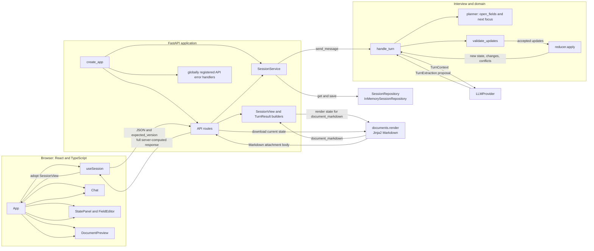

# Architecture

This document describes the architecture implemented in this repository, not a proposed production system. The application's source of truth is `WishesState`; the browser and LLM are clients/adapters around server-owned state. See [PROJECT_DOCUMENTATION.md](PROJECT_DOCUMENTATION.md) for the full project and domain overview. Companion references for validation, API contracts, and testing can be added as `VALIDATION_AND_STATE.md`, `API_REFERENCE.md`, and `TESTING.md`.

## System Diagram



The diagram shows the main relationships; response shaping and document rendering are synchronous work in the API process, not separate services. `SessionRepository` and `LLMProvider` are Python protocols, not network services. The only repository implementation wired by default is `InMemorySessionRepository`.

## Components

| Component | Responsibility | Actual source files |
|---|---|---|
| Application composition | `create_app()` loads settings, builds the provider, creates the session service, registers error handlers and routes, and optionally mounts built frontend files. It accepts injected settings, provider, and repository for tests. | [backend/app/main.py](../backend/app/main.py) |
| Settings and provider selection | `Settings` reads environment settings; `build_provider()` selects `AnthropicProvider` for `anthropic`, otherwise `RuleBasedProvider` for `mock`. | [backend/app/config.py](../backend/app/config.py), [backend/app/llm/factory.py](../backend/app/llm/factory.py) |
| HTTP boundary | `/api` endpoints parse requests, call `SessionService`, and return response DTOs or Markdown downloads. | [backend/app/api/routes.py](../backend/app/api/routes.py) |
| Request/response DTOs | Pydantic request models and response views; `session_view()` derives fields, progress, focus, next question, and Markdown from a `Session`. | [backend/app/api/schemas.py](../backend/app/api/schemas.py) |
| API error translation | Converts request validation, missing sessions, version conflicts, LLM errors, and unexpected exceptions to the common `{error: ...}` response shape. | [backend/app/api/errors.py](../backend/app/api/errors.py) |
| Session use cases | Starts, loads, messages, and directly edits sessions; checks client versions before work and persists successful outcomes. | [backend/app/services/sessions.py](../backend/app/services/sessions.py) |
| Interview orchestration | Builds `TurnContext`, invokes the provider, handles malformed-output repair/refusal, validates and reduces proposals, and applies the reply policy. | [backend/app/services/interview.py](../backend/app/services/interview.py) |
| Session persistence boundary | `SessionRepository` defines add/get/save. `InMemorySessionRepository` stores frozen session snapshots under a thread lock and checks versions during save. | [backend/app/services/session_store.py](../backend/app/services/session_store.py) |
| Domain state and update types | `WishesState`, `Field[T]`, `FieldStatus`, `Gift`, `Executor`, field paths, and `ProposedUpdate` define the typed state and transition inputs. | [backend/app/domain/models.py](../backend/app/domain/models.py), [backend/app/domain/updates.py](../backend/app/domain/updates.py) |
| Domain decisions | `validate_updates()` checks value types, evidence, dependencies, and duplicate paths. `reducer.apply()` creates immutable state transitions. Planner functions choose the next open field and calculate progress. | [backend/app/domain/validation.py](../backend/app/domain/validation.py), [backend/app/domain/reducer.py](../backend/app/domain/reducer.py), [backend/app/domain/planner.py](../backend/app/domain/planner.py) |
| LLM boundary and implementations | `LLMProvider.extract(ctx)` returns `TurnExtraction`; the factory supplies an Anthropic adapter or a rule-based demo provider. `ScriptedProvider` replays test responses. | [backend/app/llm/interface.py](../backend/app/llm/interface.py), [backend/app/llm/contracts.py](../backend/app/llm/contracts.py), [backend/app/llm/factory.py](../backend/app/llm/factory.py), [backend/app/llm/anthropic_provider.py](../backend/app/llm/anthropic_provider.py), [backend/app/llm/mock_provider.py](../backend/app/llm/mock_provider.py), [backend/app/llm/prompts.py](../backend/app/llm/prompts.py) |
| Document rendering | `render(state)` builds Markdown from the current state and a Jinja2 template; it does not call an LLM. | [backend/app/documents/generator.py](../backend/app/documents/generator.py), [backend/app/documents/templates/wishes.md.j2](../backend/app/documents/templates/wishes.md.j2) |
| Frontend API and types | `api` sends same-origin `/api` fetch requests and maps failures to `ApiError`; TypeScript DTOs mirror backend response shapes. | [frontend/src/api/client.ts](../frontend/src/api/client.ts), [frontend/src/api/types.ts](../frontend/src/api/types.ts) |
| Frontend session workflow | `useSession()` loads or creates sessions, sends messages and edits with the current version, adopts server views, and handles retries and conflicts. | [frontend/src/hooks/useSession.ts](../frontend/src/hooks/useSession.ts) |
| Frontend views | `App` composes chat, state panel/editor, and document preview. | [frontend/src/App.tsx](../frontend/src/App.tsx), [frontend/src/components/Chat.tsx](../frontend/src/components/Chat.tsx), [frontend/src/components/StatePanel.tsx](../frontend/src/components/StatePanel.tsx), [frontend/src/components/FieldEditor.tsx](../frontend/src/components/FieldEditor.tsx), [frontend/src/components/DocumentPreview.tsx](../frontend/src/components/DocumentPreview.tsx) |
| Container and hosting configuration | Docker builds static frontend assets and the Python API image. Render config declares a Docker web service and environment settings. | [Dockerfile](../Dockerfile), [render.yaml](../render.yaml) |

## Request Lifecycle

### Chat message

1. The user submits text in `Chat`. The component trims it, prevents an empty or concurrent send, and calls `useSession.send()`.

2. `useSession` sends `POST /api/sessions/{session_id}/messages` with `content` and the current `session.version` as `expected_version`. The pending user bubble is temporary UI state; it is not yet an authoritative session update.

3. `routes.post_message()` validates the Pydantic request, trims the content, rejects blank content, and calls `SessionService.send_message()`. FastAPI runs this synchronous route in a worker thread, which keeps the blocking provider call off the event loop.

4. `SessionService` loads the session and checks `expected_version` before the model call. It prepares the next user-message turn and history, then calls `handle_turn()` with the saved `WishesState`.

5. `handle_turn()` forms a `TurnContext` from the state, open fields, the last ten history messages, and the latest message. The planner's open-field ordering informs the model context; the selected provider returns a structured `TurnExtraction` proposal.

6. Malformed output is retried once with a repair hint. If the retry is malformed, or if the provider refuses, the field state stays unchanged and a deterministic planner question is returned. `LLMNotConfigured` and `LLMUnavailable` propagate to API error handling instead of persisting the attempted user turn.

7. For a valid extraction, `FieldUpdate.to_proposed()` converts model entries into domain proposals. `validate_updates()` normalizes and filters those proposals. `reducer.apply()` processes accepted proposals in `FIELD_PATHS` order, returns the new state, changes, and conflicts, and does not mutate the input state.

8. The planner chooses the next focus. The model's reply is kept only if `asks_about` matches the planned focus and there are no conflicts or rejected updates; otherwise the service uses a deterministic question.

9. `SessionService` creates a new immutable `Session` snapshot with the state, appended user and assistant messages, and change log. `SessionRepository.save()` checks the expected version again under its lock and increments `Session.version`.

10. The route builds a `TurnResult`. `session_view()` supplies the complete field list, flattened confirmed state, messages, progress, focus, next question, and `document_markdown` rendered from the saved state. The result also includes reply, changes, rejected updates, and warnings.

11. On success, `useSession` calls `adopt(result)`, replacing its session with the server response and storing the session ID in `localStorage`. `App` passes that view to `Chat`, `StatePanel`, and `DocumentPreview`.

### Direct field edit

`PATCH /api/sessions/{session_id}/fields` takes a field path, value, and expected version. It bypasses `handle_turn()` and the LLM: `SessionService.edit_field()` wraps the value as a `correction` from `UI_EDIT`, runs the same semantic validator and reducer, then saves using the repository version check. `useSession.editField()` adopts the returned `SessionView`, and the UI can display the recalculated next question. The edit does not append chat messages or increment the chat-turn counter.

### Read and document requests

`GET /api/sessions/{session_id}` returns `session_view()` from the current repository snapshot. `GET /api/sessions/{session_id}/document` loads the session and calls `render()` directly, returning Markdown with `Content-Disposition` filename `personal-wishes-draft.md`. Neither read endpoint calls the LLM.

## LLM Provider Boundary

The application depends on this protocol, defined in `backend/app/llm/interface.py`:

```python
class LLMProvider(Protocol):
    name: str

    def extract(self, ctx: TurnContext) -> TurnExtraction: ...
```

`build_provider(settings)` in `backend/app/llm/factory.py` selects `AnthropicProvider` when `LLM_PROVIDER=anthropic`; otherwise it constructs `RuleBasedProvider`. The default setting is `mock`. Provider implementations convert provider output to the common Pydantic `TurnExtraction` contract. This isolates the service and domain from the Anthropic SDK.

`AnthropicProvider` sends the generated schema, system prompt, and per-turn user content through Anthropic's structured-output API. `RuleBasedProvider` is a small deterministic regex stand-in for local use. `ScriptedProvider` consumes queued JSON strings or exceptions for tests; it is not selected by `build_provider()` for normal app startup. Regardless of provider, extraction is a proposal: the application still performs semantic validation and state reduction. The document generator is outside this boundary and never calls an LLM.

## State Ownership and Concurrency

The UI holds a `SessionView` for display and the session ID in browser `localStorage`; it does not own canonical field values. Every successful message or edit response replaces the local view with the complete server result. The current version from that view is sent with each mutation. A failed send leaves the user text available for retry; a version conflict causes `useSession` to reload the latest session and show a notice.

`Session.version` is an optimistic concurrency token. `SessionService` checks it before potentially costly message processing, then `InMemorySessionRepository.save()` verifies it again while holding a `threading.Lock`. A successful save increments the version even if the field state is unchanged, since message history may have changed. `WishesState.version` has a narrower meaning and increments only when the reducer records a field-state change.

This concurrency mechanism protects writes coordinated by one repository instance. It does not provide shared locking or persistence across multiple worker processes or service instances. The default repository is an in-memory dictionary; restarts discard sessions. `SessionRepository` is an extension point, but no database-backed implementation is included.

## Frontend Synchronization

`frontend/src/api/client.ts` is the HTTP adapter. It serializes `expected_version` as `expected_version`, decodes JSON responses, and turns server and network errors into `ApiError` values containing status, code, message, and retryability.

`useSession()` is the session workflow owner:

- On mount, it attempts to resume the ID in `localStorage`; if the backend returns 404, it creates a new session. A ref prevents duplicate initial loading under React StrictMode.
- On a successful send or edit, `adopt()` replaces the session view and persists its ID. The hook separately keeps transient state such as loading, pending text, last-turn highlights, errors, and notices.
- A 409 triggers a GET of the current session before the error is surfaced. A retryable failed message remains available to the user.
- `App` passes server messages and server `document_markdown` into the view components. `StatePanel` renders field state and calls the edit callback; `DocumentPreview` renders Markdown with `react-markdown` and links to the document endpoint.

The API response is deliberately a full view rather than a frontend-computed patch. This keeps displayed progress, fields, focus, and preview derived from one server state.

## Packaging and Deployment

The [Dockerfile](../Dockerfile) uses two build stages:

1. `node:22-alpine` installs frontend dependencies with `npm ci` and runs `npm run build`, producing `frontend/dist`.

2. `python:3.12-slim` installs `uv`, synchronizes the backend lockfile without dev dependencies or installing the project itself, copies `backend/app`, and copies the built assets to `/app/frontend/dist`.

The final container runs Uvicorn on `0.0.0.0` at `${PORT:-8000}` with `PYTHONPATH=/app/backend`. `create_app()` mounts the static directory at `/` only when `frontend/dist` exists, so the same FastAPI process serves UI assets and `/api` routes in the container. This is a single-container arrangement in the repository, not evidence of a deployed service.

`render.yaml` declares a Docker web service named `sharwil-winup-assignment`, uses the root Dockerfile and context, selects the free plan, and sets `/api/health` as its health-check path. It sets `LLM_PROVIDER=anthropic` and requests `ANTHROPIC_API_KEY` as an unsynced environment secret. The application health response reports configuration; it does not call Anthropic to prove reachability. The deployment still uses `InMemorySessionRepository`, so a restart loses sessions.

## Architectural Decisions and Trade-offs

| Decision in the implementation | Benefit | Cost or boundary |
|---|---|---|
| The application validates and reduces model proposals instead of letting the model write state. | State transitions, evidence requirements, conflicts, and corrections are explicit and testable. | Model extraction may be rejected, requiring another user turn; substring evidence is a grounding check, not proof of semantic correctness. |
| `WishesState` and domain models are immutable; reducer logic is a pure transition. | Previous state is not mutated in place, and reducer behavior is straightforward to test. | Updates create replacement model instances and require explicit transition logic. |
| The planner decides what field is next; model wording is conditional on matching the planner's focus. | Avoids relying on free-text interpretation to determine whether a question is safe to use. | Conversations follow a defined field order when the user has not supplied information out of order. |
| Pydantic models define both the extraction contract and API DTO validation. | One typed contract is used for parsing and FastAPI/OpenAPI request/response schemas. | Frontend types mirror backend DTOs manually and can drift unless kept in sync. |
| `LLMProvider` is a protocol and provider choice is centralized in `build_provider()`. | Provider-specific SDK behavior remains in the adapter. | Only Anthropic and mock implementations are wired by the factory today. |
| Documents are generated from confirmed state with Jinja2, not composed by an LLM. | Document output is reproducible and candidates do not get rendered as confirmed facts. | Wording and document content are intentionally template-bound. |
| `SessionRepository` abstracts storage while the default uses memory. | The use-case service is not coupled to a database API. | There is no persistence, shared state, retention, or cross-process locking in the included implementation. |
| Session versions use optimistic concurrency. | Stale browser writes are rejected instead of silently overwriting newer state. | The guarantee is limited to a shared repository implementation; the in-memory lock is process-local. |
| Docker builds frontend and backend into one container. | UI and API can share one origin without a separately deployed frontend service. | Frontend and backend releases are coupled; there is no independent scaling or static CDN configuration in this repository. |

## Limitations and Future Architecture

### Current limitations

- Session state is process-local and volatile. The in-memory lock cannot coordinate multiple processes or instances.
- There is no authentication or authorization, and possession of a session ID is enough to access it. There is no delete-session route.
- The health endpoint checks settings, not database or provider readiness. There is no database in the current architecture.
- Choosing Anthropic sends user message and context to an external provider. The repository does not implement an account-level consent workflow, durable retention policy, or application-level rate limiting.
- The regex provider has deliberately narrow language coverage. The Anthropic provider's live behavior depends on credentials and network access.
- Render and Docker configuration exist, but this architecture inspection does not verify a deployed Render service.

### Possible future work, not implemented

- Implement a durable `SessionRepository` with atomic compare-and-save semantics, migrations, backup/restore, and retention/deletion policy.
- Add authentication and per-session authorization before treating session IDs as private user data.
- Add operational controls appropriate to personal data: transport/storage protections, secret management, provider data-processing review, and privacy-safe monitoring.
- Separate liveness from readiness checks and include dependencies only when their real readiness can be tested without creating user-facing side effects.
- Add CI for build, lint, type checks, test suites, and a controlled model-evaluation workflow; continue to distinguish deterministic tests from live-model quality checks.
- Consider independent frontend asset hosting or scaling only if the deployment requirements justify the additional infrastructure.

These improvements are architectural options, not features of the current repository. Planned companion documents can cover implementation-level state behavior (`VALIDATION_AND_STATE.md`), behavior and test coverage (`TESTING.md`), and exact wire contracts (`API_REFERENCE.md`) when they are added.
