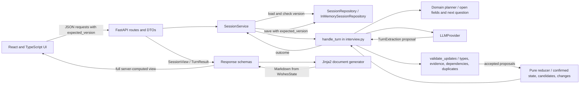
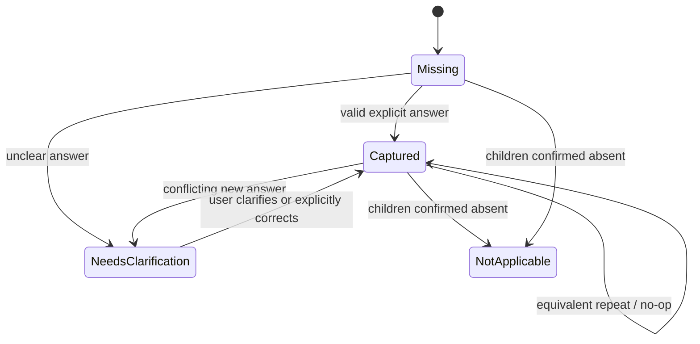

# Project Documentation

> Implementation reference for the repository, inspected on 2026-10-09. Source code is authoritative where older planning documents differ.

## 1. Project Overview

The Document Intake Assistant collects answers through a multi-turn chat, stores them in a typed record, and renders a fictional Personal Wishes Document draft from confirmed values. It addresses a common weakness of free-form assistants: conversation text alone is difficult to audit, and a model can misunderstand, omit, or invent details.

The intended scope is a technical demonstration of reliable state handling around an LLM. Users can answer in natural language, inspect what was captured, clarify or correct it, and download the resulting Markdown draft. The app does not establish legal facts, give legal advice, or create a document with legal effect. The generated draft is explicitly labelled fictional and not legal advice.

The core engineering principle is: **"The model proposes; the application decides."** A provider proposes typed updates. Deterministic validation checks them, the reducer applies accepted updates, the planner selects the next field, and the document generator renders the approved state. The model does not write the session state or generate the document.

## 2. Features

| Capability | Implemented behavior |
|---|---|
| Conversational collection | Multi-turn chat accepts one message at a time; one message may propose multiple field updates. The request is limited to 2,000 characters. |
| Structured extraction | Model output follows a Pydantic-derived JSON schema and is parsed into `TurnExtraction`, then converted to domain `ProposedUpdate` values. |
| Status and provenance | Each field has an explicit status. Captured chat values record the source turn and quoted evidence; panel edits record `source="edit"`. Corrections can retain the replaced value. |
| Ambiguity and contradiction | Unclear answers and conflicting new answers are held as candidates; a confirmed value is retained until the user clarifies. |
| Explicit corrections | Chat corrections and panel edits use the reducer's correction behavior. A repeated equivalent value is a no-op. |
| Interview planning | A deterministic planner prioritizes fields needing clarification, then missing fields, in the declared field order. Captured and not-applicable fields are skipped. |
| Preview and download | API responses include a server-rendered Markdown draft; a separate endpoint serves it as `personal-wishes-draft.md`. The UI renders the returned Markdown and exposes download. |
| Error handling | API errors use a common envelope. Stale versions return 409; provider configuration and availability errors return 503; malformed output and refusal use an unchanged-state fallback turn. |
| Session handling | The browser stores the session ID in `localStorage` for resume. The backend repository is in-memory; after its restart, an unknown saved ID causes the frontend to create a new session. |

The no-key `RuleBasedProvider` is a limited regex demo, not general language understanding. The UI identifies it as the demo model.

## 3. Technology Stack

| Layer | Technologies in the repository |
|---|---|
| Backend | Python 3.12+, FastAPI, Pydantic v2, `pydantic-settings`, Uvicorn |
| Frontend | React 19, TypeScript, Vite, `react-markdown` |
| LLM | Anthropic Python SDK; schema-constrained structured output; `LLMProvider` protocol for provider isolation |
| Document generation | Jinja2 Markdown template; deterministic Python context builder |
| Backend tests and checks | pytest, FastAPI `TestClient`, Ruff, mypy in strict mode |
| Frontend tests and checks | Vitest, Testing Library, jsdom, oxlint, TypeScript compiler |
| Dependency and local tooling | `uv` with `backend/uv.lock`, npm, Make |
| Deployment | Multi-stage Docker build; Render Blueprint in `render.yaml` |

Dependency declarations are in [backend/pyproject.toml](../backend/pyproject.toml) and [frontend/package.json](../frontend/package.json). Exact installed versions are controlled by the lockfiles where present.

## 4. System Overview

The frontend calls the FastAPI routes under `/api`. Routes delegate session use cases to `SessionService`; the interview service connects the provider to deterministic domain validation, reduction, and planning. `InMemorySessionRepository` stores immutable session snapshots. Response DTO construction renders a document from the state, and the React UI displays the server-returned fields, messages, progress, and Markdown.

### System Architecture



### User-message lifecycle

1. `POST /api/sessions/{session_id}/messages` validates the request shape, trims the content, loads the session, and checks `expected_version` before calling the provider.
2. `SessionService.send_message` builds turn context from the current state, open fields, the last ten stored messages, and the latest user message.
3. `handle_turn` calls the selected provider. Malformed output is retried once with a repair hint; a second malformed response or a refusal leaves field state unchanged and uses a planner question. Unconfigured or unavailable provider errors propagate to the API, and the turn is not saved.
4. The service converts proposed updates to domain updates. `validate_updates` normalizes values and rejects invalid evidence, types, dependencies, and duplicate paths.
5. `reducer.apply` processes accepted updates in field order. This ensures `has_children` is settled before `children_names`, irrespective of the model's output order.
6. The planner selects the next focus. The model's suggested wording is retained only when its `asks_about` matches that focus and there are no conflicts or rejected updates; otherwise deterministic wording is used.
7. On success, user and assistant messages are appended and the repository saves the next session version with an atomic optimistic-concurrency check.
8. The response includes the complete session view. `session_view` renders the document from the resulting state; the frontend does not independently derive field state or document content.

## 5. Domain Model

`WishesState` in `backend/app/domain/models.py` is the source of truth. The nine paths below are the entries in `FieldPath` and `FIELD_PATHS`; the two executor paths are nested under `Executor` in the model.

| Field path | Stored value type | Meaning and completion rule |
|---|---|---|
| `full_name` | `str` | User's full name; required. |
| `home_address` | `str` | Home address; required. |
| `covers_worldwide_assets` | `bool` | Whether the document covers worldwide assets; required. |
| `has_children` | `bool` | Whether the user has children; required. |
| `children_names` | `list[str]` | Names when `has_children` is true; not applicable when the confirmed answer is false. |
| `executor.name` | `str` | Executor's name; required. |
| `executor.relationship` | `str` | Executor's relationship to the user; required. |
| `specific_gifts` | `list[Gift]` | Gifts with `item` and `recipient`; an explicitly answered empty list means none. |
| `additional_wishes` | `str` | Additional wishes; an explicitly answered empty string means none. |

Each path has a generic `Field[T]` with `value`, `status`, `candidate`, `note`, `source_turn`, `source`, `evidence`, and `previous_value`.

| Status | Representation |
|---|---|
| `missing` | No confirmed value; normally `value=None`. The field remains open for the planner. |
| `needs_clarification` | The proposed answer is held in `candidate`, with a `note`; a previous confirmed `value` is preserved when resolving a contradiction. |
| `captured` | `value` is the confirmed value. Chat provenance includes `source="chat"`, the one-based user-message turn, and quoted evidence. Edits use `source="edit"` and no evidence. For edits, `source_turn` is set to the current chat-turn count (which may be 0); it does not identify an edit event. |
| `not_applicable` | Used for `children_names` after `has_children` is confirmed false. It is treated as complete by the planner. |

`Field`, `Executor`, `Gift`, and `WishesState` are frozen Pydantic models. `WishesState.version` increments when the reducer makes a state change. This domain version is distinct from `Session.version`, which increments on every successful repository save, including a turn that adds messages but changes no field.

## 6. LLM Integration

The application depends on the `LLMProvider` protocol in `backend/app/llm/interface.py`:

```python
class LLMProvider(Protocol):
    name: str

    def extract(self, ctx: TurnContext) -> TurnExtraction: ...
```

`TurnContext` contains the current `WishesState`, remaining field paths, recent history, latest user message, and an optional repair hint. The model-facing `TurnExtraction` requires `updates`, `reply`, and `asks_about`. Each `FieldUpdate` has a path, typed value, `kind` (`new` or `correction`), `certainty` (`explicit` or `unclear`), and evidence. The JSON schema is generated from these strict Pydantic models, and `parse_extraction` parses JSON and validates it against the same contract.

The provider's output is only a proposal. `FieldUpdate.to_proposed()` maps it to a domain `ProposedUpdate`; semantic validation and the reducer decide whether it becomes state. A provider cannot directly mutate the session or document.

| Provider | Actual responsibility |
|---|---|
| `AnthropicProvider` | Sends the versioned prompt and a JSON-schema structured-output request to Anthropic. Uses the configured model, effort, timeout, one SDK retry, and the `server-side-fallback-2026-07-01` beta fallback setting. Parses response text through `parse_extraction`; maps authentication, permission, model-not-found, timeout, rate-limit, API, and connection errors to application-level LLM errors. Refusal and truncation are handled separately. |
| `RuleBasedProvider` | Default for `LLM_PROVIDER=mock`. A small regex-based demonstration provider recognizes limited patterns and short answers to the current focus. It is not general natural-language understanding. Its generated JSON still passes through `parse_extraction` and the same downstream validation and reducer. |
| `ScriptedProvider` | Replays raw responses or exceptions from a queue. Tests use it to exercise valid, ambiguous, rejected, malformed, and failure responses through the real interview pipeline. |

The current Anthropic defaults are model `claude-opus-5-5`, effort `low`, and timeout 30 seconds. Values are configurable as described in [Local Development](#10-installation-and-local-development). `PROMPT_VERSION` is defined in `backend/app/llm/prompts.py`. The prompt includes captured values, remaining fields, recent history, and the latest user message, with the latest message fenced as data.

## 7. Validation and State Management

The state transitions below summarize the documented behavior; actual transitions are enforced by semantic validation and the reducer.



`validate_updates` checks domain semantics after the extraction contract has validated shape:

- Boolean paths require actual booleans; text paths require strings; child names must be a non-empty list of non-empty names; gifts must contain non-empty `item` and `recipient` values.
- Text is whitespace-normalized. Non-optional text cannot be empty; `specific_gifts` and `additional_wishes` can represent an explicit "none" answer.
- Chat evidence must occur in the latest user message after case, whitespace, and edge-punctuation normalization. Direct UI edits do not require evidence.
- Children names are rejected while `has_children` is confirmed false, unless the same input proposes true.
- Only the first update for a path in one turn is eligible; later duplicate-path proposals are rejected.

`reducer.apply` distinguishes a first answer, an unclear answer, a contradiction, a correction, and an unchanged repeat. Unclear answers become candidates rather than confirmed values. A differing `new` value against a captured value opens a clarification conflict; `correction` replaces the prior answer and records it as `previous_value` when applicable. Explicit empty gift and additional-wishes values represent "none". Child names imply `has_children=true` only when that field is missing; names wait in a candidate while a yes/no conflict is unresolved.

The planner asks the first field needing clarification, then the first missing field, in `FIELD_PATHS` order. Completion counts captured and not-applicable fields. The UI edit path uses the same semantic validator and reducer as a correction. A dedicated `VALIDATION_AND_STATE.md` companion document can expand on these rules when added to the repository.

## 8. API Overview

All application routes use the `/api` prefix. Request DTOs forbid extra properties. Full request and response schemas are published through FastAPI's OpenAPI documentation at `/docs` while the backend is running.

| Method and path | Responsibility |
|---|---|
| `GET /api/health` | Returns `status`, configured provider name, and whether the selected provider is configured. This is a configuration check, not a model connectivity/readiness check. |
| `POST /api/sessions` | Creates an empty session and returns its initial assistant greeting/question. |
| `GET /api/sessions/{session_id}` | Returns the server-computed session view. |
| `POST /api/sessions/{session_id}/messages` | Accepts `content` and `expected_version`; processes and persists a user turn on success. |
| `PATCH /api/sessions/{session_id}/fields` | Accepts `path`, `value`, and `expected_version`; applies a direct field edit as a correction. |
| `GET /api/sessions/{session_id}/document` | Returns the rendered Markdown draft as an attachment named `personal-wishes-draft.md`. |

`SessionView` includes the session ID and version, field views, confirmed-value state, messages, rendered Markdown, progress, completion status, focus, and next question. `TurnResult` adds the reply, changes, rejected updates, and warnings.

Mutating requests carry a non-negative `expected_version`. The service checks it before a model call, and the repository checks it again atomically during save. A successful save increments `Session.version`; a mismatch returns a retryable 409 `version_conflict`. The frontend reloads on a conflict. The domain `WishesState.version` is separate and changes only when fields change.

Errors use `{ "error": { "code": "...", "message": "...", "retryable": false } }`. Implemented codes include `session_not_found` (404), `version_conflict` (409), `validation_error` (422), `llm_not_configured` (503), `llm_unavailable` (503, retryable), and `internal_error` (500). Provider availability errors occur before persistence, so the submitted turn is not saved. A dedicated `API_REFERENCE.md` companion document can provide full request and response examples when added to the repository.

## 9. Testing and Evaluation

The backend suite covers models, semantic validation, reducer rules, planner ordering, document output, provider contracts and adapters, interview pipeline behavior, API errors, health, and the evaluation harness. The 12 JSON files in `backend/tests/fixtures/llm_responses/` provide recorded extraction responses, including multi-field, unclear, correction, contradiction, invented evidence, wrong types, and malformed-output cases. Anthropic adapter tests use a fake SDK client rather than making live requests. Document tests use empty, partial, and complete Markdown snapshots.

The frontend suite consists of `frontend/src/App.test.tsx` and `frontend/src/format.test.ts`. The app tests use a fake backend; they do not require a live API or LLM.

**Verified in this checkout on 2026-10-09:** `uv run pytest -q` in `backend/` reported **155 passed**. Vitest reported **15 passed** across two test files. The `npm test -- --run` executable shim was blocked on this machine with `Operation not permitted`; invoking the installed test runner directly with `node node_modules/vitest/vitest.mjs --run` passed the same frontend suite. No test result below is inferred from an older README claim.

`backend/scripts/eval.py` contains eight scripted conversation scenarios and checks state, field status, completion, re-asking, and selected document phrases. `make eval` runs against the configured provider; evaluation with Anthropic requires a valid key and can incur API cost. The live evaluation was not run for this documentation task, so no live-model pass rate or latency is claimed. In mock mode, the script explicitly notes that the regex provider is expected to miss language-understanding scenarios; it also returns exit code 0 regardless of scenario failures, so a successful mock-mode process exit is not evidence that those scenarios passed.

Useful repository commands are defined in [Makefile](../Makefile): `make test`, `make lint`, and `make eval`. A dedicated `TESTING.md` companion document can provide expanded test-running instructions when added to the repository.

## 10. Installation and Local Development

The repository requires Python 3.12+, `uv`, npm, and `make`. The locked frontend toolchain specifies Node.js `^20.19.0 || ^22.12.0 || >=24.0.0` in `frontend/package-lock.json`; the README's "Node 20+" shorthand omits the minimum minor version. Python's minimum is enforced by `backend/pyproject.toml`.

From the repository root:

```sh
make install
make dev
```

`make install` runs `uv sync` in `backend/`, copies `backend/.env.example` to `backend/.env` if `.env` does not exist, and runs `npm install` in `frontend/`. `make dev` starts Uvicorn on port 8000 and Vite on port 5173. The Vite dev proxy forwards `/api` to `http://localhost:8000`; the current `frontend/vite.config.ts` also allows `API_PROXY_TARGET` to override the proxy target. The backend mock provider is the default, so a real key is not needed for the demo.

The component startup paths were smoke-checked in this environment: Uvicorn returned a successful `/api/health` response with `LLM_PROVIDER=mock`, and Vite served the frontend entry page. The aggregate `make install` target was not rerun because it can install dependencies and create `.env`; the commands above reflect the checked-in Makefile rather than a fresh dependency installation.

To select Anthropic, set these values in `backend/.env` or the backend process environment, then restart it:

```dotenv
LLM_PROVIDER=anthropic
ANTHROPIC_API_KEY=replace-with-your-own-key
LLM_MODEL=claude-opus-5-5
LLM_EFFORT=low
LLM_TIMEOUT_S=30
```

`ANTHROPIC_API_KEY` is a placeholder here, not a credential. Never commit a real key. `.env` is ignored by Git and `.env.example` contains no secret. `LLM_PROVIDER` accepts `mock` or `anthropic`; `LLM_EFFORT` accepts `low`, `medium`, `high`, `xhigh`, or `max`. Selecting Anthropic without a non-empty key does not prevent server startup, but chat requests return `llm_not_configured` and health reports `model_configured=false`.

## 11. Deployment

The [Dockerfile](../Dockerfile) builds the frontend in a Node 22 Alpine stage using `npm ci` and `npm run build`. A Python 3.12 slim stage installs the locked, non-development backend dependencies, copies `backend/app` and the built `frontend/dist`, and starts Uvicorn on `PORT` or 8000. `app.main.create_app` serves the built frontend from FastAPI when that `dist` directory exists, allowing the configured container to serve UI and API from one origin.

`render.yaml` declares one Docker web service using the root Dockerfile, the free plan, and `/api/health` as its health-check path. It sets `LLM_PROVIDER=anthropic` and declares `ANTHROPIC_API_KEY` with `sync: false`, so the value is supplied outside the YAML. For a Render deployment, supply a valid Anthropic key through the Render environment settings. The health endpoint only reports application/configuration state; it does not verify that Anthropic is reachable.

These files describe a deployment configuration, not evidence that a service has been deployed or tested on Render. The container still uses the in-memory session repository, so the deployment configuration does not provide durable session storage.

## 12. Limitations and Security

### Current limitations

- `InMemorySessionRepository` loses all sessions when its process restarts. It is also process-local; the repository contains no shared database or cross-instance session store.
- There is no authentication or authorization. A session ID is sufficient for the API to retrieve that session; the random ID is not an identity or access-control system.
- The API does not expose a session deletion endpoint. "Start over" creates another session; it does not delete the old in-memory session.
- The rule-based mock provider handles only a limited set of patterns. The LLM-backed path depends on the configured Anthropic service and network availability.
- The app has no jurisdiction-specific legal rules or legal review, no medical functionality, and no claim of legal effect. Streaming and PDF/Word export are not implemented in the inspected routes.
- `/api/health` checks provider configuration, not external service readiness. The repository does not implement a production data-retention policy or durable audit store.

### Security and privacy considerations

Names, addresses, family details, and wishes are personal data. When the Anthropic provider is selected, the latest user message, recent conversation context, and captured field values are included in the provider request. The repository implements no account access control, database encryption, retention/deletion policy, or application-level rate limiting. Do not use real personal data in this demo without an appropriate privacy and security review. Keep API credentials in environment settings or a secret manager, never in source control.

The application validates evidence and renders documents from confirmed state, but those safeguards are not a substitute for access control, privacy controls, legal review, or operational security. Possible future work documented in [PRODUCTION_NOTES.md](../PRODUCTION_NOTES.md) includes durable storage, accounts and authorization, data-protection controls, monitoring, and legal review. Those are recommendations, not current features.

## 13. Repository Structure

```text
.
|-- backend/
|   |-- app/
|   |   |-- api/          FastAPI routes, request/response DTOs, error handlers
|   |   |-- domain/       WishesState, update values, validation, reducer, planner
|   |   |-- documents/    Jinja2 Markdown renderer and template
|   |   |-- llm/          Provider interface, extraction contract, prompt, adapters, factory
|   |   |-- services/     Interview orchestration, session use cases and repository
|   |   `-- config.py     Environment-backed settings
|   |-- scripts/eval.py  Scripted conversation evaluation
|   |-- tests/            Backend tests, recorded LLM responses and document snapshots
|   `-- pyproject.toml    Backend dependencies and tool configuration
|-- frontend/
|   |-- src/api/         API client and mirrored TypeScript DTOs
|   |-- src/components/  Chat, field state, editor and document preview
|   |-- src/hooks/       Session loading and mutation workflow
|   `-- package.json     Frontend dependencies and scripts
|-- docs/                Product/technical plans, build records, compliance, media and screenshots
|-- videos/              Walkthrough-video project sources and assets
|-- Dockerfile           Multi-stage frontend/backend image build
|-- Makefile             Install, development, test, lint and evaluation targets
|-- render.yaml          Render Docker service configuration
|-- README.md            Quick start and project summary
`-- PRODUCTION_NOTES.md  Production gaps and proposed improvements
```

Related repository documents include [README.md](../README.md), [TRD.md](TRD.md), [PRD.md](PRD.md), [BUILD_JOURNAL.md](BUILD_JOURNAL.md), [AI_LOG.md](../AI_LOG.md), and [PRODUCTION_NOTES.md](../PRODUCTION_NOTES.md), where those files are present. Planned companion documents include `ARCHITECTURE.md`, `VALIDATION_AND_STATE.md`, `TESTING.md`, and `API_REFERENCE.md`.
